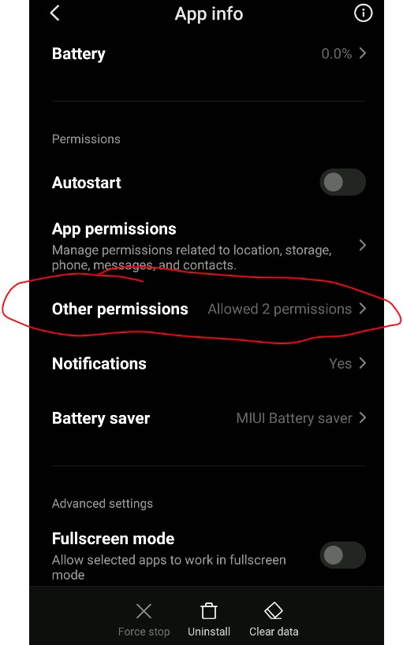
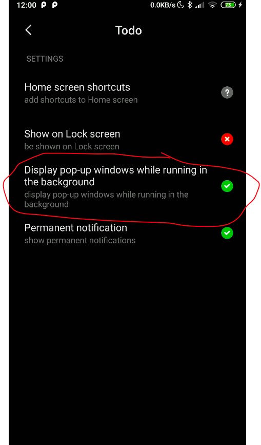
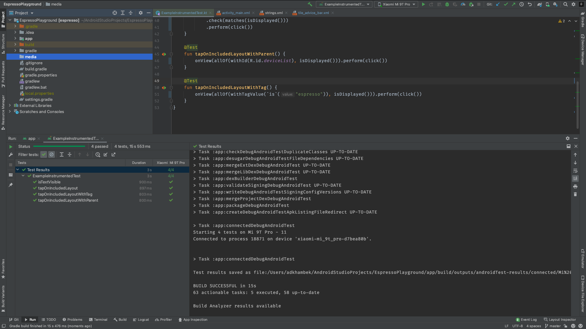

>this also happening to my test when following codelab from google kotlin unit test
when im trying to run the test via emulator, it run perfectly, but when i run into my device, which is xiaomi redmi note 5, the error showed up like yours,
i found an answer in this question and it directed to this github

Offical post [stackoverflow](https://stackoverflow.com/a/70231611)

  
  

  

